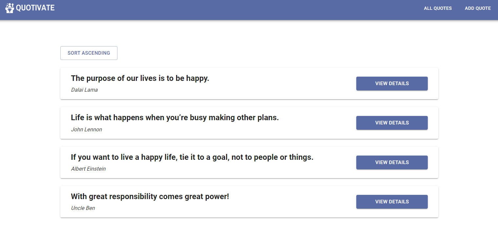

## 👆 Quotivate
Simple react app that utilizes redux for state management and firebase for a real-time database. It lets you add motivational quotes and see each individual quote in full detail (author and the quote itself) separately. The purpose of this app was to learn redux, react-router, and material UI.



##  🚀 Technologies used
- React 18
- React-router
- Formik + Yup for form validation
- Material UI
- Redux

## 👀 Quick preview
You can check out the app here:
<a href="https://quotivate-react.netlify.app/" target="_blank">Quotivate</a> 
(WARNING: Opens in the same tab)

## 🔥 Inspiration
The idea came from a project from [this](https://www.udemy.com/course/react-the-complete-guide-incl-redux/) amazing React course by Maximilian Schwarzmüller.

## 👩‍💻 Setup 
To run this project install it locally using npm:
```
$ git clone https://github.com/dimitarradulov/quotivate.git
$ cd quotivate
$ npm install
$ npm start
```
